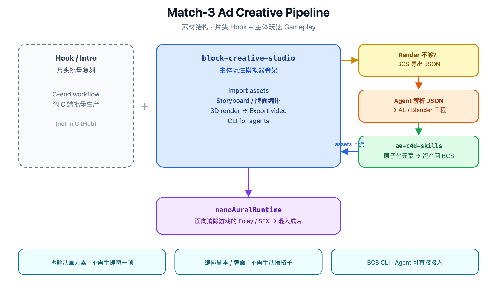

<!-- 
  Hi! I'm Dongyuan Li — an internet engineer with 5+ years in user growth, 
  casual games, ad creatives, and AI-native applications. Also lifting heavy things.
-->

<h1 align="center">Hi 👋, I'm Dongyuan</h1>
<h3 align="center">User Growth Engineer | AI Agent Builder | Olympic Weightlifter</h3>

  
  
  

---

### 🔭 What I'm Working On
- **Casual Puzzle Games**: Building match-3 / block-puzzle gameplay, retention loops, and live-ops systems  
- **User Growth**: Designing incentive-driven viral loops, multi-channel activation funnels, and scalable referral architectures  
- **Ad Acquisition**: Running performance UA and iterating on playable / video / image creatives for casual games  
- **AI Agents**: Building production-grade workflow agents with LangChain 1.x, DeepAgents & **LangGraph**  

### 🎬 Ad Creative Pipeline

A UA creative is **hook + gameplay**.

The **hook** is batch-remade through a C-end production workflow (not in this GitHub). The **gameplay body** is built on [block-creative-studio](https://dongyuan21.github.io/block-creative-studio/) — a simulator skeleton that imports assets, storyboards the board, renders in 3D, and exports video. BCS also ships as a CLI so agents can drive it.

When the 3D render isn't enough, BCS dumps JSON. An agent turns that JSON into After Effects / Blender projects. [ae-c4d-skills](https://github.com/dongyuan21/ae-c4d-skills) then parses those source files, atomizes animation elements into reusable assets, and feeds them back into BCS.

That loop exists to kill two kinds of toil: **hand-tweening every shot**, and **manually laying out every board**.

SFX for elimination games is generated by [nanoAuralRuntime](https://github.com/dongyuan21/nanoAuralRuntime).

  

  <a href="./creative-pipeline.excalidraw">Open the Excalidraw source</a>

### 💪 Strength Beyond Code
- **Olympic Weightlifting**: Snatch **70kg** | Clean & Jerk **90kg** | Power Clean **100kg**
- **Basketball**: Team player on and off the court 🏀
- **Philosophy**: *"In the age of AI, aesthetic judgment and values matter most."*

### 🌱 Currently Exploring
- **Intelligent Creative Generation**: Automating ad image / video production pipelines for casual-game UA  
- **Data Agent**: Building agents that query, analyze, and act on growth & ad-performance data  
